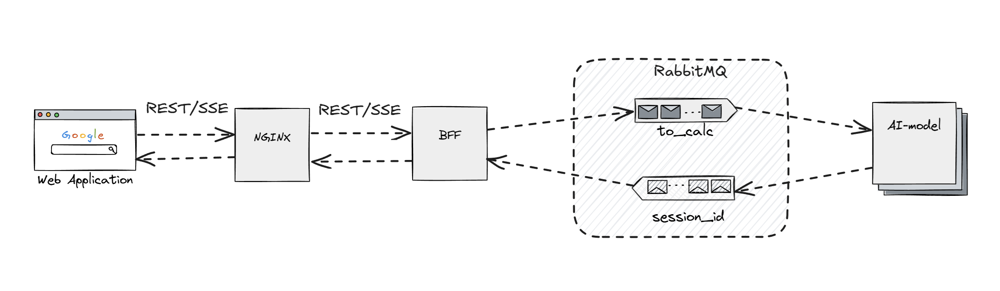

# Фуллстек-приложение для Siam ML Hack 2025
## Frontend
Клиентская часть написана на **react** с **vite** и сторах **mobx** с дизайн-системой **CONSTA**.

Структура проекта поддерживалась на основе методологии **FSD**.

Общение с Backend-частью происходит через **REST** и **SSE** для получения обновлений в реальном времени.

## Backend
Серверная часть реализована на **python** с фреймворком **FastAPI**.

### Передача сообщений
Для достижения асинхронной работы используется **RabbitMQ**, настройка которого происходит прямо из кода.

Для обновлений в реальном времени используется **SSE**. Каждый вызов из клиентского кода имеет уникальный идентификатор сессии, который затем используется для обозначения очереди в брокере. Когда сообщение из очереди будет прочитано, она автоматически удалится.

### Расчет параметров ИИ-модели
Сервис с ИИ-моделью представляет собой воркер, которые ожидает команды на расчет из **RabbitMQ**. После успешного выполнения он создаст новую очередь для соответствующей клиентской сессии и отправит сообщение туда.

Для упрощения приложения воркер может выбирать модели по типу команды на расчет.


## Архитектура


## Задания для выполнения
1. Разработка решения для обнаружения бинарных признаков в данных гидродинамических исследований скважин.
2. Разработка решения для определения наличия и границ полезных данных для анализа в результатах гидродинамических исследований скважин.

## Развертывание
Проект можно развернуть через docker compose *(ci/local/docker-compose.yaml)*.
Предварительно нужно создать файлы .env в папках ci, фронтенда и сервисов бекенда.
```
docker-compose up -d
```